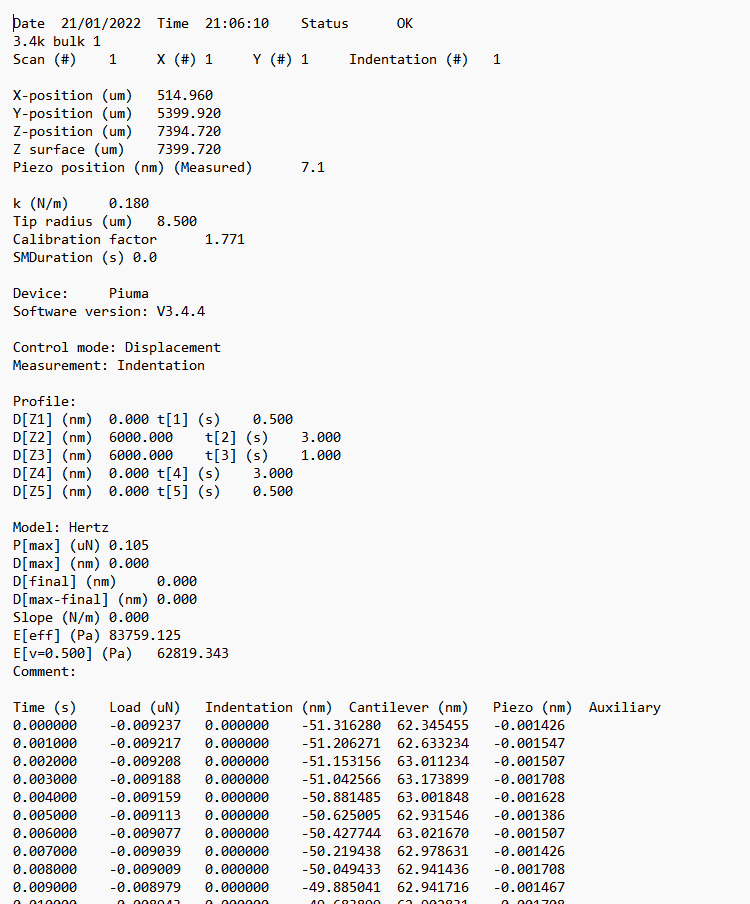
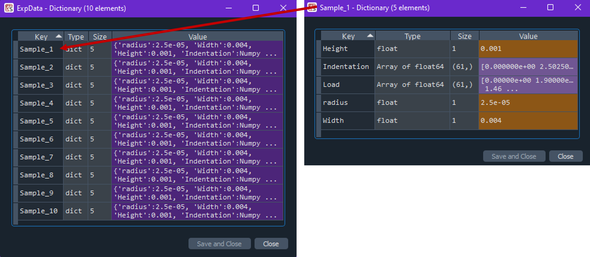
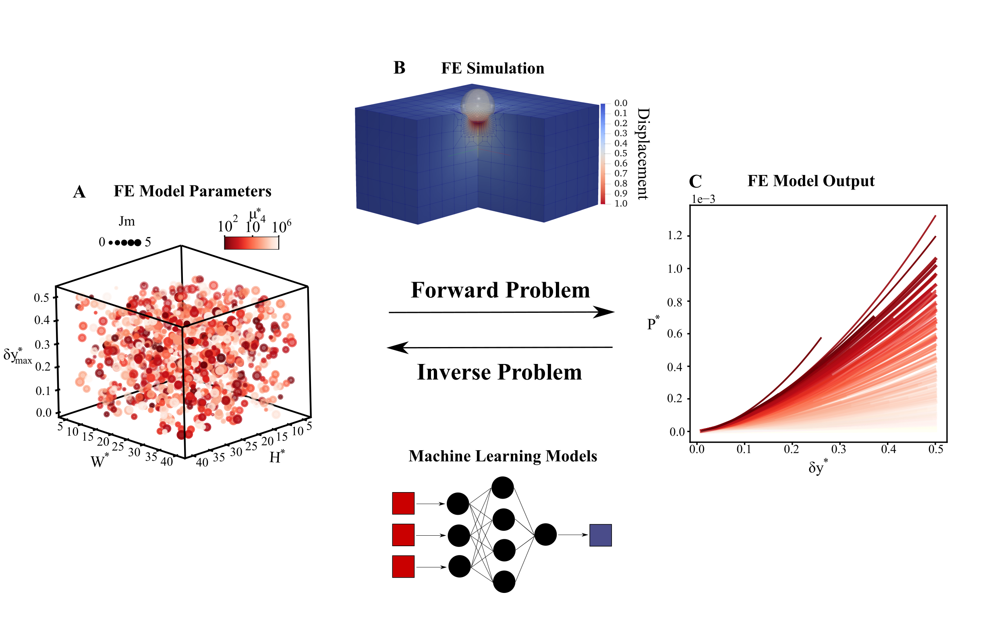
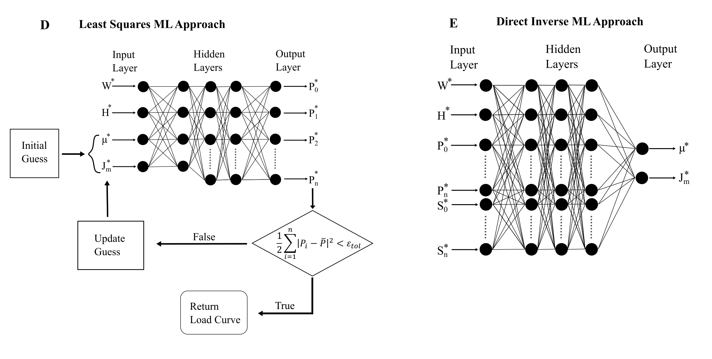
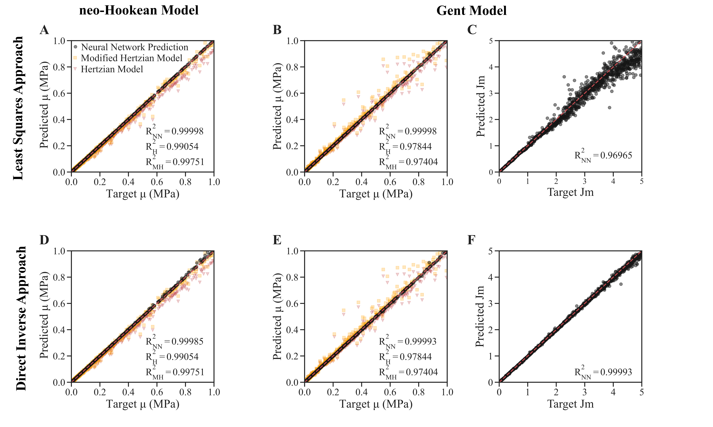
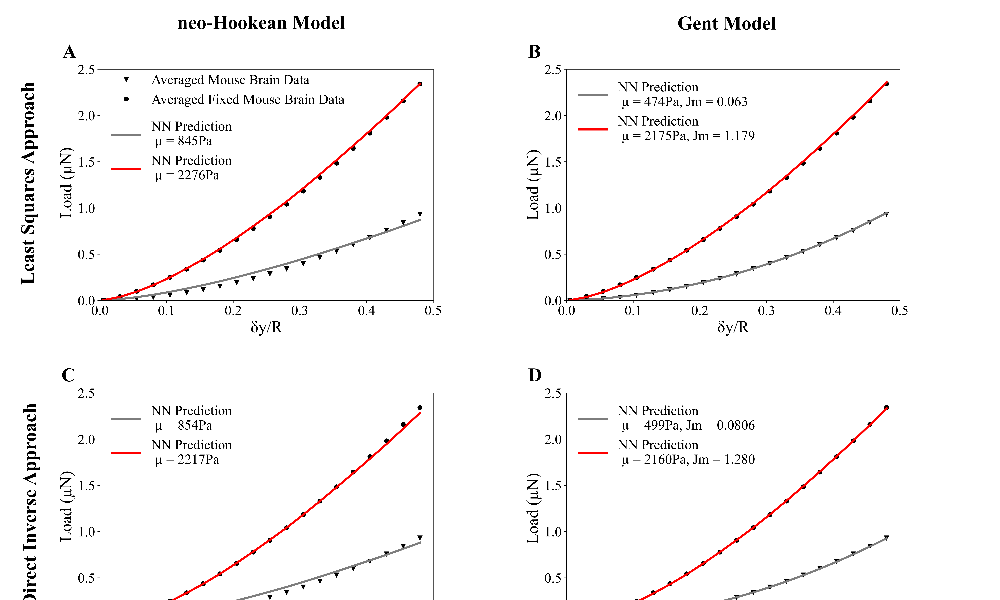
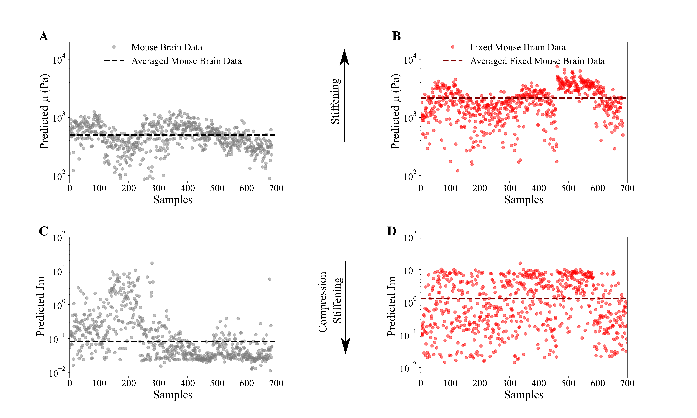

# Nanoindentation
Utilize machine learning for accelerated parameter identification from indentation data. Machine learing models are trained with synthetic data generated by nonlinear mixed finite element models.
 
 
 
 
## Quick Start
 
**Clone Repository**
 - Bare minimum pull the directories Trained_NN_Models, data, and results as well as the files main_AnalyzeData.py and subfunctions_AnalyzeData.py
 - Inside the directory Nanoindentation/data/ExperimentalData place your data
 - Pull directory src_generate_fe_dataset (optional: for generating new synthetic data)
 - Pull directory src_train_metamodels (optional: for training new neural networks)
 
**Software requirements**
 - Python 3 & libraries: pickle
 - TensorFlow/Keras
 - Febio3 (optional: to generate new synthetic data
         
         'C:/Program Files/Coreform Cubit 2022.4/bin/coreform_cubit.exe')
 - Cubit Coreform 2022.4 (optional: to generate new synthetic data
         
         'C:/Program Files/FEBioStudio/febio/febio3.exe')

 
**Input**
 
Either place extracted data or raw data in the folder using the formats below.
 
 Raw data structure:
 ======

  
 Code will search for postition of key words, but it should be structured like:
 
 
 
  
 _Extracted data structure:_
  
 Use nested dictionaries to store your runs and input into ML model
 Name of outer keys do not matter, but nested key names are **specific**:
  
    - "Radius": (float) stores radius of indenter in meters
     
    - "Width": (float) stores width of sample in meters
     
    - "Thickness": (float) stores thickness of sample in meters
     
    - "Indentation": (array) stores indentation depth in meters
     
    - "Load": (array) stores load values in newtons
     
 
 
 
**Output**
  
Model outputs a text file containing identified material parameters as well as the calculated RSME of the forward model produced with the predicted material parameters normalized to the RMSE of a Hertzian fit.
  
### Example
  
  
  
  
  
  
## Summary
 
### Synthetic Data Generation

Our machine learning (ML) models are trained on data generated from finite element (FE) simulations. To test the ability of our model's ability for accurate parameter identification of thin complex soft-tissues we examined two material models: neo-Hookean and Gent material model. Latin hypercube sampling was used to sample the four parameter input space ( $\delta y$, $W$, $H$, and $\mu$) for the neo-Hookean material model, and five parameter input space ( $\delta y$, $W$, $H$, $\mu$, and $Jm$) for the Gent material model to generate a FE input file, see Figure 1A. The FE input file was then fed into the implicit mixed FE model to generate a load-displacement curve output, FE output file, see Figure 1B,C. Figure 1A-C represents the forward problem, while the inverse problem, determining material parameters from experimental data, is accomplished through the use of two machine learning models.
  
  

  
 **Figure 1**
 
  
  
### Inverse Problem: Machine Learning
 
Two different ML appraoches were used to solve the inverse problem trained on either neo-Hookean or Gent FE model data. The first machine learning model used a neural network to learn the forward problem, predict the loading curve ( $P^*_n$) from material properties ( $\mu^*$, $Jm^*$) and sample dimensions ( $W^*$, $H^*$), which is called as the mapping function for a nonlinear least squares algorithm to solve the inverse problem, see Figure 2D. The second machine learning model used a neural network to directly learn the inverse problem, predict material parameters ( $\mu$, $Jm$) from sample dimensions ( $W^*$, $H^*$), loading curve ( $P^*_n$), and the slope of the loading curve ( $S^*_n$), see Figure 2E
 

   
 **Figure 2**
   
   
    
  
### Training, Validation, and Testing of Neural Networks
 
The four neural networks were trained and validated before their ability to predict unseen data, testing data set, was evaluated. Comparison of the neural network (black dots) prediction of unseen data to the Hertzian solution (red triangle) and Modified Hertzian solution (orange squares). Predicted shear modulus is plotted against target shear modulus, where the dotted red line is a perfect prediction, for the least squares ML approach (Figure 3A,B) and the direct inverse ML approach (Figure 3D,E). For the ML models trained on the Gent FE model prediction of the Jm material parameter was plotted against the known target values, see Figure 3 C,F. $ R^2$ values were included for each parameter of each of the ML models to compare their accuracy. The Hertzian and modified-Hertzian models were shown to be unreliable at predicting an accurate shear modulus for material that behaves lik a Gent Material, see Figure 3B,E. While the least squares ML approach proved unable to predict accurate Jm values greater than 1, see Figure 3C.
 
 

**Figure 3**

 
 
  
### Experimental Data: Brain Tissue
 
With the ML models ability to accurately predict useen synthetic data the model was then used to analyze highly nonlinear brain tissue before and after chemical fixation. Comparison of the averaged loading curves (686 samples) from mouse brain slices (black triangle marker), and the averaged loading curves (686 samples) from chemically fixed mouse brain slices (black circle marker) were plotted with the neural network predictions in red and grey, respectively, see Figure 4A Neo-Hookean material model with the least squares ML approach, Figure 4B Gent material model with the least squares ML approach, Figure 4C Neo-Hookean material model with the direct inverse ML approach, and Figure 4D Gent material model with the direct inverse ML approach. Predicted material parameters are included in the respective legend. Both the least squares ML approach and direct inverse ML approach trained on Gent FE model data were able to accurately capture the compression stiffening behaviour of brain tissue.
 
  

  
**Figure 4**
 
 
  
   

  
The predicted material parameters for the Gent material model with the direct inverse ML approach were plotted for the mouse brain slices (Figure 5A,C) (grey circle markers) and chemically fixed mouse brain slices (Figure 5B,D) (red circle markers). The Gent material parameters for the averaged experimental loading curves for the mouse brain slices (red dotted line) and chemically fixed brain slices (black dotted line) are plotted over the parameters determined for the individual data samples. The chemical fixation caused a statistically significant stiffening in the brain tissues, while the compression, strain-dependent, stiffening behaviour of the tissue was reduced.

  
 **Figure 5**

 
 
  
## Layout of Repository

### SynthData
#### FEmodel_Input_Output

### Trained_NN_Models
### Functions
### ExperimentalData
### Results

