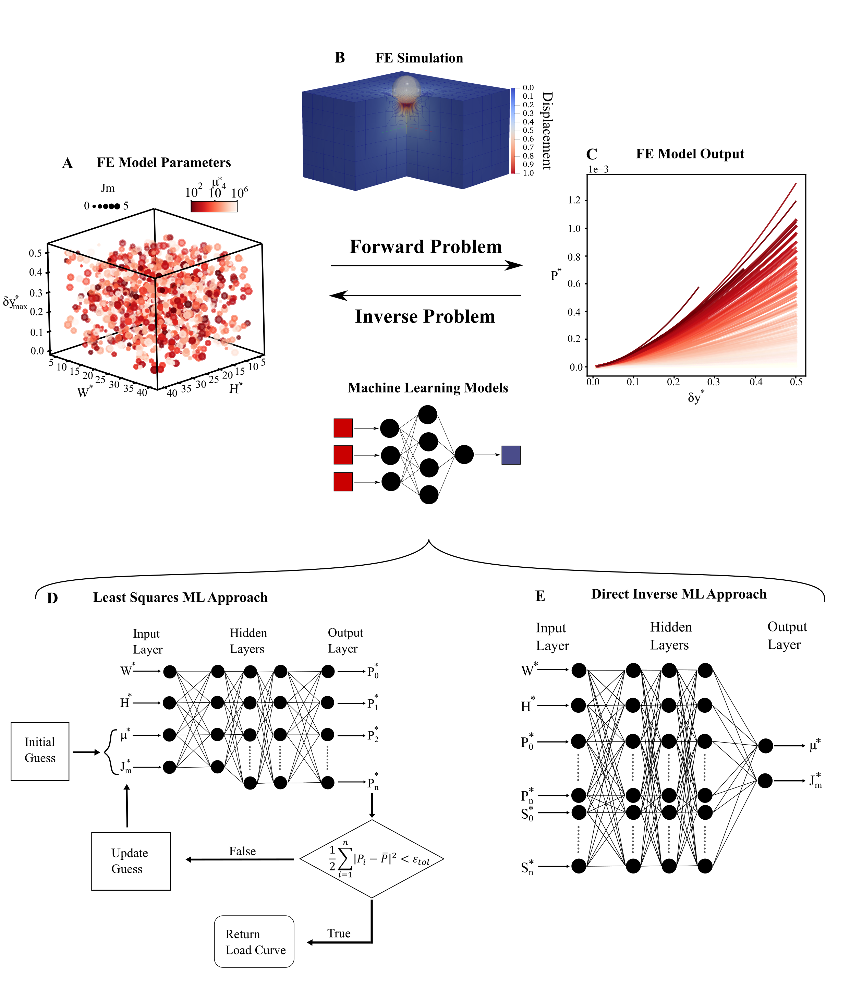

# Nanoindentation
Utilize machine learning for accelerated parameter identification from indentation data. Machine learing models are trained with synthetic data generated by nonlinear mixed finite element models.

$\delta y$

**Summary of the modelling approaches.** A) LHS was used to sample the four parameter input space ($\delta y$, $W$, $H$, and $\mu$) for the neo-Hookean material model, and five parameter input space ($\delta y$, $W$, $H$, $\mu$, and $Jm$) for the Gent material model to generate a FE input file. B) The FE input file was fed into the implicit mixed FE model (C) to generate a load-displacement curve output, FE output file. (A-C) represents the forward problem, while the inverse problem, determining material parameters from experimental data, is accomplished through the use of two machine learning models. (D) the first machine learning model used a neural network to learn the forward problem, predict the loading curve ($P^*_n$) from material properties ($\mu^*$, $Jm^*$) and sample dimensions ($W^*$, $H^*$), which is called as the mapping function for a nonlinear least squares algorithm to solve the inverse problem. (E) the second machine learning model used a neural network to directly learn the inverse problem, predict material parameters ($\mu$, $Jm$) from sample dimensions ($W^*$, $H^*$), loading curve ($P^*_n$), and the slope of the loading curve ($S^*_n$)
